<!--
  README do João Vitor — Estilo Cartoon Preto e Branco Anos 30 (Tema NOIR)
  Personalizado com os dados do currículo: CCI Gris, PUC Campinas, stack de Dados e I.A
  Fundo: Paleta Noir (Preto, Branco e Cinza)
-->

<!-- ===== BANNER SVG INTERATIVO ===== -->

  

<!-- ===== BADGE DO SITE (GitHub Pages — estúdio vintage) ===== -->

<!-- ===== FAIXA DE CABEÇALHO NOIR (estilo cinema vintage) ===== -->

<h3 style="margin:0; font-size:28px; color:#FFFFFF; letter-spacing:2px; font-family:serif;">JOÃO VITOR — JAYVI 🎬</h3>

ANALISTA DE DADOS E I.A · CIÊNCIA DE DADOS — PUC CAMPINAS · CCI GRIS

🎞️ "direto dos anos 30, no clima Steamboat Willie" &nbsp;·&nbsp; @JayV1I

<!-- ===== CONTAINER DE FUNDO NOIR (Branco Sólido com bordas Pretas) ===== -->

<!-- ===== BOAS-VINDAS ===== -->

<h1 style="margin:0; font-size:36px; color:#000000; font-family:serif;">
Olá, eu sou o João Vitor! 👋🎞️</h1>

<blockquote style="border-left:6px solid #000000; background:#F8F8F8; color:#000000; padding:15px 20px; text-align:left; margin:20px 8px; box-shadow: 6px 6px 0 #000000;">

<strong>Analista de Dados e I.A | Ciência de Dados — PUC Campinas</strong>

Especialista em pipelines de dados end-to-end: ETL automatizado, machine learning em produção, Power BI em clientes de logística e eficiência empresarial. Focado em transformar dados brutos em decisões estratégicas com visão estatistica utilizando Python, Azure, CI/CD e LLMs.

</blockquote>

<!-- ===== BADGES INTERATIVAS (clicáveis) ===== -->

  
  
  
  

<!-- ===== BEM-VINDO ===== -->
<table>
  <tr>
    <td valign="top" width="60%">

<h3 style="color:#000000; font-size:24px; border-bottom:3px solid #000000; padding-bottom:5px;">🎬 O que você vai encontrar aqui</h3>

Seja bem-vindo ao meu bloco, desenhado à moda antiga! Sou **Assistente de Dados e I.A na CCI Gerenciamento de Riscos (CCI Gris)** e estudante de **Ciência de Dados e I.A na PUC Campinas**. Aqui você vai encontrar meus projetos, tecnologias e histórias — tudo num visual de **desenho animado clássico em preto e branco**. 🎞️

- 🚀 **Pipeline completo de dados**: da extração web e ETL automatizado até ML em produção
- 🛠️ **Power BI**: responsável por 33 dashboards de produção para clientes de logística
- 🤖 **Machine Learning**: +1,2 milhão de registros de não conformidades e sinistros
- ☁️ **Azure & Docker**: deploy na nuvem com CI/CD via GitHub Actions
- 💪 E a energia de quem economizou ~12 horas/semana com automação

    </td>
    <td valign="middle" width="40%" align="center">
      
    </td>
  </tr>
</table>

<!-- ===== ESTATÍSTICAS ===== -->

  <h3 style="color:#000000; font-size:24px; border-bottom:3px solid #000000; display:inline-block; padding:0 20px;">📊 Bilheteria e Resultados</h3>

  
  

  

<!-- ===== SOBRE MIM ===== -->

  <h3 style="color:#000000; font-size:24px; border-bottom:3px solid #000000; display:inline-block; padding:0 20px;">🎞️ O Cartaz da Semana</h3>

<table style="margin-top:20px;">
  <tr>
    <td valign="middle" width="40%" align="center">
      
    </td>
    <td valign="middle" width="60%">

**Assistente de Análise de Dados e I.A na CCI Gris**, responsável por todo o pipeline de dados — da extração web e automação de ETL até machine learning e entrega em Power BI. Aplicando ML sobre dado real de produção (+1,2 milhão de registros), substituindo processos manuais por automação e levando soluções de dados para a nuvem (Azure).

| Característica | Descrição |
|---|---|
| 💼 Atual | Assistente de Dados e I.A — CCI Gerenciamento de Riscos |
| 🎓 Formação | Ciência de Dados e I.A — PUC Campinas (2023-2027) |
| 🐍 Stack | Python, Pandas, Scikit-learn, PySpark, SQL/NoSQL |
| ☁️ Cloud | Azure (Container Apps, Blob Storage), Docker, CI/CD |
| 🗄️ Dados & BI | PostgreSQL, Mongo DB, Power BI, Power Automate, Excel/VBA |
| 🌀 Cabelo | Cacheado, volumoso e com personalidade |

    </td>
  </tr>
</table>

<!-- ===== TECNOLOGIAS ===== -->

  <h3 style="color:#000000; font-size:24px; border-bottom:3px solid #000000; display:inline-block; padding:0 20px;">🛠️ As Ferramentas do Estúdio</h3>

  

<!-- ===== O QUE ESTOU APRENDENDO ===== -->

  <h3 style="color:#000000; font-size:24px; border-bottom:3px solid #000000; display:inline-block; padding:0 20px;">📽️ Produções em Destaque</h3>

<table>
  <tr>
    <td valign="middle" width="65%">

Enquanto você lê isso, eu estou:

- Aplicando **machine learning** em +1,2 milhão de registros: clusterização (K-Means/DBSCAN), séries temporais (Prophet) e classificação supervisionada
- Substituindo rotinas 100% manuais por **automação ETL** em Python — já economizei ~12 horas/semana!
- Levando soluções de dados para a **nuvem Azure** com CI/CD automatizado via GitHub Actions
- Tomando café ☕ e voltando pro código com força total

    </td>
    <td valign="middle" width="35%" align="center">
      
    </td>
  </tr>
</table>

<!-- ===== CONTATO ===== -->

  <h3 style="color:#000000; font-size:24px; border-bottom:3px solid #000000; display:inline-block; padding:0 20px;">📟 Entre em Contato</h3>

<table style="margin-top:20px;">
  <tr>
    <td valign="middle" width="40%" align="center">
      
    </td>
    <td valign="middle" width="60%">

Se você quer bater um papo, trabalhar num projeto junto ou só mandar um oi, minha porta está sempre aberta! 🚀

- 📧 Email: **Terabyteplay@gmail.com**
- 💼 LinkedIn: [linkedin.com/in/jvitorop](https://www.linkedin.com/in/jvitorop)
- 📱 WhatsApp: (19) 99606-0208

    </td>
  </tr>
</table>

<!-- ===== RODAPÉ ===== -->

  

  Desenhado à mão em preto e branco • Est. 2026 • <a href="https://github.com/JayV1I" style="color:#000000;">@JayV1I</a>

<!-- fim do container de fundo noir -->
