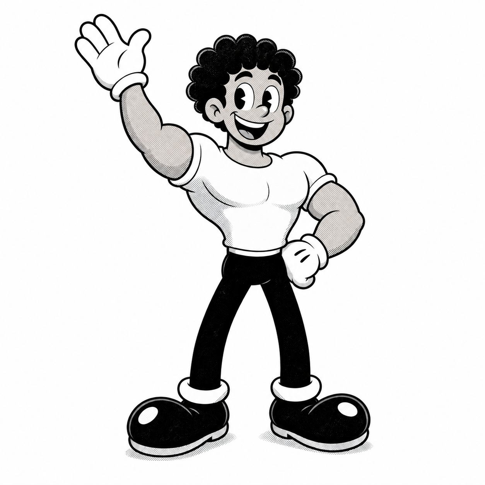

<!--
  README do João Vitor — Estilo Cartoon Preto e Branco Anos 30 (moldura de filme)
  Personalizado com os dados do currículo: CCI Gris, PUC Campinas, stack de Dados e I.A
-->

<!-- ===== BANNER SVG INTERATIVO ===== -->

  

# Olá, eu sou o João Vitor! 👋🎞️

> **Analista de Dados e I.A | Ciência de Dados — PUC Campinas**
>
> Especialista em pipelines de dados end-to-end: ETL automatizado, machine learning em produção, Power BI em clientes de logística e eficiência empresarial. Focado em transformar dados brutos em decisões estratégicas com visão estatistica utilizando Python, Azure, CI/CD e LLMs.

<!-- ===== BADGES INTERATIVAS (clicáveis) ===== -->

  
  
  
  

<!-- ===== BEM-VINDO ===== -->
<table>
  <tr>
    <td valign="top" width="60%">

### 🎬 O que você vai encontrar aqui

Seja bem-vindo ao meu bloco, desenhado à moda antiga! Sou **Assistente de Dados e I.A na CCI Gerenciamento de Riscos (CCI Gris)** e estudante de **Ciência de Dados e I.A na PUC Campinas**. Aqui você vai encontrar meus projetos, tecnologias e histórias — tudo num visual de **desenho animado clássico em preto e branco**. 🎞️

- 🚀 **Pipeline completo de dados**: da extração web e ETL automatizado até ML em produção
- 🛠️ **Power BI**: responsável por 33 dashboards de produção para clientes de logística
- 🤖 **Machine Learning**: +1,2 milhão de registros de não conformidades e sinistros
- ☁️ **Azure & Docker**: deploy na nuvem com CI/CD via GitHub Actions
- 💪 E a energia de quem economizou ~12 horas/semana com automação

    </td>
    <td valign="middle" width="40%" align="center">
      
    </td>
  </tr>
</table>

<!-- ===== ESTATÍSTICAS ===== -->
### 📊 Minhas estatísticas animadas

  
  

  

<!-- ===== SOBRE MIM ===== -->
### 🎞️ Sobre mim

<table>
  <tr>
    <td valign="middle" width="40%" align="center">
      
    </td>
    <td valign="middle" width="60%">

**Assistente de Análise de Dados e I.A na CCI Gris**, responsável por todo o pipeline de dados — da extração web e automação de ETL até machine learning e entrega em Power BI. Aplicando ML sobre dado real de produção (+1,2 milhão de registros), substituindo processos manuais por automação e levando soluções de dados para a nuvem (Azure).

| Característica | Descrição |
|---|---|
| 💼 Atual | Assistente de Dados e I.A — CCI Gerenciamento de Riscos |
| 🎓 Formação | Ciência de Dados e I.A — PUC Campinas (2023-2027) |
| 🐍 Stack | Python, Pandas, Scikit-learn, PySpark, SQL/NoSQL |
| ☁️ Cloud | Azure (Container Apps, Blob Storage), Docker, CI/CD |
| 🗄️ Dados & BI | PostgreSQL, Power BI (33 dashboards), Power Automate, Excel/VBA |
| 🌀 Cabelo | Cacheado, volumoso e com personalidade |

    </td>
  </tr>
</table>

<!-- ===== TECNOLOGIAS ===== -->
### 🛠️ Tecnologias que eu uso

  

> **Editando acima é fácil:** acesse [skillicons.dev](https://skillicons.dev), escolha suas tecnologias e copie o novo link no lugar do que está aí.

<!-- ===== O QUE ESTOU APRENDENDO ===== -->
### 📚 Aprendendo agora

<table>
  <tr>
    <td valign="middle" width="65%">

Enquanto você lê isso, eu estou:

- Aplicando **machine learning** em +1,2 milhão de registros: clusterização (K-Means/DBSCAN), séries temporais (Prophet) e classificação supervisionada
- Substituindo rotinas 100% manuais por **automação ETL** em Python — já economizei ~12 horas/semana!
- Levando soluções de dados para a **nuvem Azure** com CI/CD automatizado via GitHub Actions
- Tomando café ☕ e voltando pro código com força total

    </td>
    <td valign="middle" width="35%" align="center">
      
    </td>
  </tr>
</table>

<!-- ===== PROJETOS ===== -->
### 🚀 Meus projetos em destaque

### 🔹 Monitoramento da Cesta Básica (Azure & Docker)

Plataforma de monitoramento de preços da cesta básica com Python, ML e cloud. Dashboards interativos em Dash/Plotly, segmentação com PCA + KMeans, containerização com Docker e deploy no Azure (Container Apps, ACR, Blob Storage), com CI/CD totalmente automatizado via GitHub Actions.

### 🔹 Road Scan Dashboard (CCI Gris)

Solução ponta a ponta para análise de acidentes rodoviários no Brasil: ETL, análise exploratória (EDA), modelagem preditiva com Random Forest, PostgreSQL e dashboard interativo em React. Feature engineering e BI para transformar dados brutos de acidentes em insights acionáveis de risco.

### 🔹 Automação RPA e ETL (CCI Gris)

Automação ponta a ponta do pipeline de ETL de logística em Python: extração automatizada de relatórios web (requests, Selenium), consolidação e deduplicação com pandas/openpyxl e publicação automática de dashboards no Power BI via RPA (Power Automate Desktop). Substituí uma rotina 100% manual, economizando ~12 horas/semana e garantindo que 33 dashboards atualizem toda manhã.

  

<!-- ===== GRÁFICO DE CONTRIBUIÇÕES ANIMADO ===== -->
### 🎞️ Filmstrip de contribuições (365 dias)

  

<!-- ===== CONTATO ===== -->
### 📬 Contato — vamos fazer algo juntos!

<table>
  <tr>
    <td valign="middle" width="40%" align="center">
      
    </td>
    <td valign="middle" width="60%">

Se você quer bater um papo, trabalhar num projeto junto ou só mandar um oi, minha porta está sempre aberta! 🚀

- 📧 Email: **Terabyteplay@gmail.com**
- 💼 LinkedIn: [linkedin.com/in/jvitorop](https://www.linkedin.com/in/jvitorop)
- 📱 WhatsApp: (19) 99606-0208

    </td>
  </tr>
</table>

<!-- ===== RODAPÉ ===== -->

  

  Desenhado à mão em preto e branco • Est. 2026 • <a href="https://github.com/JayV1I">@JayV1I</a>

<!-- créditos das artes: personagem e ilustrações gerados por IA no estilo cartoon anos 30 -->
